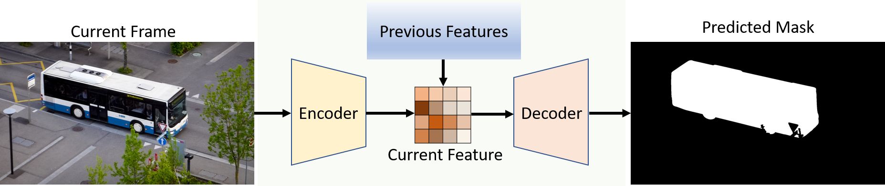
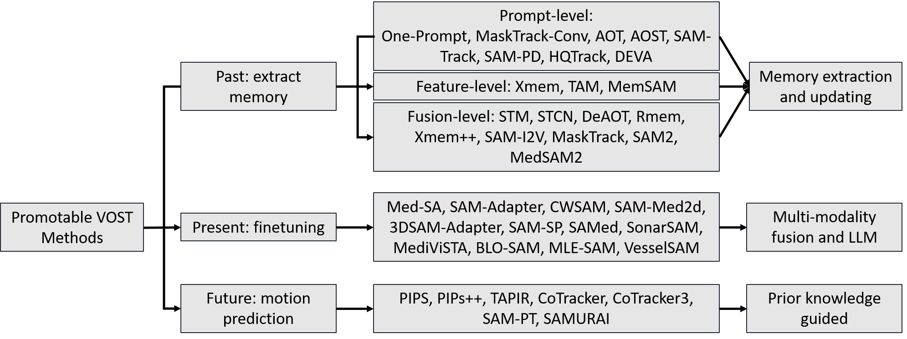

# Segment Anything for Video: VOST Review
Guoping Xu1, Jayaram K. Udupa2, Yajun Yu1, Hua-Chieh Shao1, Songlin Zhao3, Wei Liu3, You Zhang1*

1 The Medical Artificial Intelligence and Automation (MAIA) Laboratory, Department of Radiation Oncology, University of Texas Southwestern Medical Center, Dallas, TX, USA  
2 Medical Image Processing Group, University of Pennsylvania, USA  
3 Department of Radiation Oncology, Mayo Clinic, USA  


## 1. Basic Architecture for VOST
The standard pipeline for Video Object Segmentation and Tracking consists of three primary components:
1.  **Encoder**: Extracts features from the current frame[cite: 8].
2.  **Memory/Feature Update**: Incorporates features from preceding frames to provide temporal-spatial cues, facilitating target recognition and differentiation[cite: 8, 9].
3.  **Decoder**: Generates the final predicted mask for the current frame[cite: 10].


---

## 2. Representative Published Works


| Method | Publication | Core Mechanisms | Advantages & Limitations |
| :--- | :--- | :--- | :--- |
| **[MaskTrack ConvNet](https://openaccess.thecvf.com/content_cvpr_2017/html/Perazzi_Learning_Video_Object_CVPR_2017_paper.html)** | CVPR 2017 | Concatenates previous mask with current frame as input to guide segmentation. | Simple and effective short-term propagation, but cannot handle large appearance changes, drift, or long-term occlusion. |
| **[AOT](https://arxiv.org/abs/2106.02638)** | NeurIPS 2021 | Identification mechanism with transformer to encode instance-level embeddings and memory association. | Strong multi-object association and propagation, but suffers from memory degradation as the number of layers increase. |
| **[SAM-Track](https://arxiv.org/abs/2305.06558)** | arXiv 2023 | Combines SAM segmentation with AOT tracking and Grounding-DINO detection. | Supports text-prompt and automatic tracking, but computationally expensive due to multi-module integration. |
| **[SAM-PD](https://arxiv.org/abs/2403.04194)** | arXiv 2024 | Prompt denoising and temporal propagation with SAM backbone by iteratively updating the bounding box. | Improves robustness to noisy prompts, but still dependent on prompt quality and not efficient for iteratively box generation. |
| **[HQTrack](https://arxiv.org/abs/2307.13974)** | arXiv 2023 | Integrates HQ-SAM with tracking pipeline for high-quality mask propagation. | Produces high-quality masks and fine boundaries, but slower inference and higher computation cost. |
| **[DEVA](https://arxiv.org/abs/2309.03903)** | ICCV 2023 | Decouples video segmentation into image-level segmentation and temporal propagation. | Flexible framework for two independent tasks, but it is complicated for temporal information propagation and cannot detect new objects by itself. |
| **[XMem](https://arxiv.org/abs/2207.07115)** | ECCV 2022 | Multi-store memory (sensory register, short-term and long-term) model inspired by Atkinson-Shiffrin memory theory. | Long-term memory retention and efficiency, but still sensitive to extreme appearance changes, object poses, and shadows. |
| **[STM](https://arxiv.org/abs/1904.00607)** | ICCV 2019 | Space-Time Memory Network storing key-value memory for mask propagation. | Pioneer work that introduces a memory mechanism that stores features from all past frames, but high memory and computation requirements. |
| **[MemSAM](https://openaccess.thecvf.com/content/CVPR2024/html/Deng_MemSAM_Taming_Segment_Anything_Model_for_Echocardiography_Video_Segmentation_CVPR_2024_paper.html)** | CVPR 2024 | Integrates SAM with memory module (similar as XMem) for temporal feature embedding. | Enhances SAM temporal consistency, but increased memory consumption. |
| **[DeAOT](https://arxiv.org/abs/2210.09782)** | NeurIPS 2022 | Decouples instance association and temporal propagation using dual-branch transformers. | Improves identity consistency and robustness in multi-object scenarios, but lacks a strong feature encoder. |
| **[Rmem](https://arxiv.org/abs/2406.08476)** | ECCV 2024 | Introduces a restricted and selective memory mechanism that filters and retains only high-confidence historical features. | Improves memory efficiency and temporal robustness, but aggressive filtering may discard useful contextual information. |
| **[SAM-I2V](https://openaccess.thecvf.com/content/CVPR2025/papers/Mei_SAM-I2V_Upgrading_SAM_to_Support_Promptable_Video_Segmentation_with_Less_CVPR_2025_paper.pdf)** | CVPR 2025 | Extends SAM to video by integrating temporal memory propagation and inter-frame feature association for VOST. | Leverages strong SAM priors for accurate segmentation, but still depends on effective memory updating and incurs higher computational cost. |
| **[MaskTrack](https://ieeexplore.ieee.org/abstract/document/10726574)** | TNNLS 2024 | Combines segmentation and tracking using mask-guided temporal feature propagation and association. | Improves segmentation-tracking integration, but performance may degrade under fast motion or heavy occlusion. |
| **[SAM2](https://arxiv.org/abs/2408.00714)** | arXiv 2024 | Introduces a streaming memory architecture with memory attention to encode and retrieve temporal features. | Enables real-time performance and strong temporal consistency; however, the memory selection strategy affects robustness in complex sequences. |
| **[MedSAM2](https://arxiv.org/abs/2504.03600)** | arXiv 2024 | Adapts SAM2 for medical video segmentation by incorporating domain-specific adaptation and temporal memory propagation. | Improves segmentation consistency in medical videos, but generalization across diverse modalities remains challenging. |
| **[Med-SA](https://www.sciencedirect.com/science/article/pii/S1361841525000945)** | MedIA 2025 | Introduces medical-specific adaptation of SAM using domain alignment and fine-tuning strategies. | Improves segmentation accuracy in medical scenarios, but requires domain-specific training data and increases complexity. |
| **[SAM-Adapter](https://arxiv.org/abs/2304.12620)** | ICCV 2023 | Inserts lightweight adapter modules into the frozen SAM encoder to enable efficient task-specific adaptation. | Parameter-efficient and flexible adaptation, but limited ability to capture large domain gaps compared to full fine-tuning. |
| **[CWSAM](https://ieeexplore.ieee.org/abstract/document/10849617)** | JSTARS 2025 | Incorporates channel-wise attention and spatial refinement modules to enhance SAM for remote sensing. | Improves feature discrimination and boundary precision, but adds architectural complexity and computational cost. |
| **[SAM-Med2d](https://arxiv.org/abs/2308.16184)** | arXiv 2023 | Fine-tunes SAM on large-scale 2D medical datasets to improve domain-specific generalization. | Improves medical segmentation performance significantly, but requires extensive annotated medical datasets. |
| **[MA-SAM](https://arxiv.org/abs/2308.16184)** | MedIA 2024 | Introduces multi-scale attention mechanisms and feature aggregation to enhance SAM’s representation of fine structures. | Improves multi-scale feature representation and accuracy, but it is designed for 3D medical image segmentation. |
| **[3DSAM-Adapter](https://arxiv.org/abs/2306.13465)** | MedIA 2024 | Extends SAM adaptation to 3D volumetric medical images using adapter-based feature learning across slices. | Enables volumetric segmentation with improved spatial consistency, but introduces higher memory consumption. |
| **[SAM-SP](https://arxiv.org/abs/2408.12364)** | arXiv 2024 | Incorporates spatial prior information into SAM to guide segmentation toward anatomically meaningful regions. | Improves robustness and anatomical consistency, but depends on the quality of spatial priors. |
| **[SAMed](https://arxiv.org/abs/2304.13785)** | arXiv 2023 | Fine-tunes SAM encoder and decoder using medical image datasets with structural adaptation. | Improves segmentation accuracy in medical tasks, but increases computational cost compared to adapter-based approaches. |
| **[SonarSAM](https://arxiv.org/abs/2306.14109)** | GRSL 2024 | Adapts SAM for sonar image segmentation by incorporating domain-specific preprocessing and feature enhancement. | Extends SAM applicability to sonar domain, but limited generalization to other imaging modalities. |
| **[MediViSTA](https://arxiv.org/abs/2309.13539)** | JBHI 2025 | Integrates vision transformer adaptation and medical-specific prompt learning for segmentation refinement. | Improves domain adaptation and segmentation robustness, but increases training and optimization complexity. |
| **[BLO-SAM](https://arxiv.org/abs/2402.16338)** | ICML 2024 | Introduces bidirectional learning optimization and prompt adaptation to improve SAM performance. | Enhances segmentation robustness and flexibility, but increases training complexity and memory usage. |
| **[DD-SAM2](https://iopscience.iop.org/article/10.1088/2632-2153/ae13d1/meta)** | MLST 2025 | Proposes a channel-wise dilated-convolution adapter for SAM2 to enhance multi-scale feature extraction. | Learning multi-scale features for improvement; however, the memory management of SAM2 remains inflexible. |
| **[PIPS](https://arxiv.org/pdf/2204.04153)** | ECCV 2022 | Introduces persistent independent particles to model dense point trajectories across video frames. | Strong long-range motion tracking, but does not directly produce segmentation masks. |
| **[TAPIR](https://arxiv.org/abs/2306.08637)** | ICCV 2023 | Combines tracking and point-level correspondence using transformer-based trajectory estimation. | High tracking accuracy and robustness, but requires additional segmentation modules for mask prediction. |
| **[CoTracker](https://arxiv.org/abs/2307.07635)** | ECCV 2024 | Uses transformer-based joint tracking of multiple points across frames for improved trajectory consistency. | Enables robust multi-point tracking, but computationally expensive for dense tracking tasks. |
| **[CoTracker3](https://arxiv.org/abs/2410.11831)** | ICCV 2025 | Improves CoTracker with enhanced scalability and robustness for long-range tracking using optimized architectures. | Improved long-term tracking performance, but it lacks object segmentation capability. |
| **[SAM-PT](https://arxiv.org/abs/2307.01197)** | CVPR 2025 | Integrates SAM segmentation with point trajectory tracking to improve temporal mask consistency. | Combines segmentation and motion tracking effectively, but requires trajectory estimation overhead. |
| **[SAMURAI](https://arxiv.org/abs/2411.11922)** | arXiv 2024 | Introduces motion-aware memory selection and trajectory-guided prompting to improve SAM-based VOS. | Improves memory efficiency and tracking robustness, but still sensitive to extreme motion and occlusion. |
---

## 3. Benchmarking Datasets

### Natural Scene Datasets
| Dataset | Website | Description |
| :--- | :--- | :--- |
| **SegTrack-v2** | [Link](https://web.engr.oregonstate.edu/~lif/SegTrack2/dataset.html) | Expanded benchmark with more objects and challenging sequences[cite: 125]. |
| **DAVIS17** | [Link](https://davischallenge.org/davis2017/code.html) | Multi-object extension with complex scenes and interactions[cite: 125]. |
| **YouTube-VOS** | [Link](https://youtube-vos.org/dataset/vos/) | Large-scale dataset with diverse real-world scenarios[cite: 125]. |
| **SA-V** | [Link](https://ai.meta.com/datasets/segment-anything-video/) | Massive dataset for fine-grained segmentation at scale[cite: 125]. |

### Medical Scenario Datasets
| Dataset | Website | Description |
| :--- | :--- | :--- |
| **Endovis18** | [Link](https://zenodo.org/records/10527017) | Robotic scene segmentation including anatomical objects[cite: 129]. |
| **EchoNet-Dynamic**| [Link](https://echonet.github.io/dynamic/index.html)| 2D apical two-chamber heart videos[cite: 129]. |
| **SUN-SEG** | [Link](https://github.com/openmedlab/Awesome-Medical-Dataset/blob/main/resources/SUN-SEG.md)| Specialized for Polyp segmentation[cite: 129]. |
| **Cell Tracking** | [Link](https://celltrackingchallenge.net/datasets/) | Biological videos for cell segmentation and tracking[cite: 129]. |


## BibTeX
Please consider to cite it if it helps your research.

```latex
@article{xu2026segment,
  title={Segment anything for video: A comprehensive review of video object segmentation and tracking from past to future},
  author={Xu, Guoping and Udupa, Jayaram K and Yu, Yajun and Shao, Hua-Chieh and Zhao, Songlin and Liu, Wei and Zhang, You},
  journal={Neurocomputing},
  volume={682},
  pages={133439},
  year={2026},
  issn={0925-2312},
  doi={10.1016/j.neucom.2026.133439},
  url={https://doi.org/10.1016/j.neucom.2026.133439}
}


```
